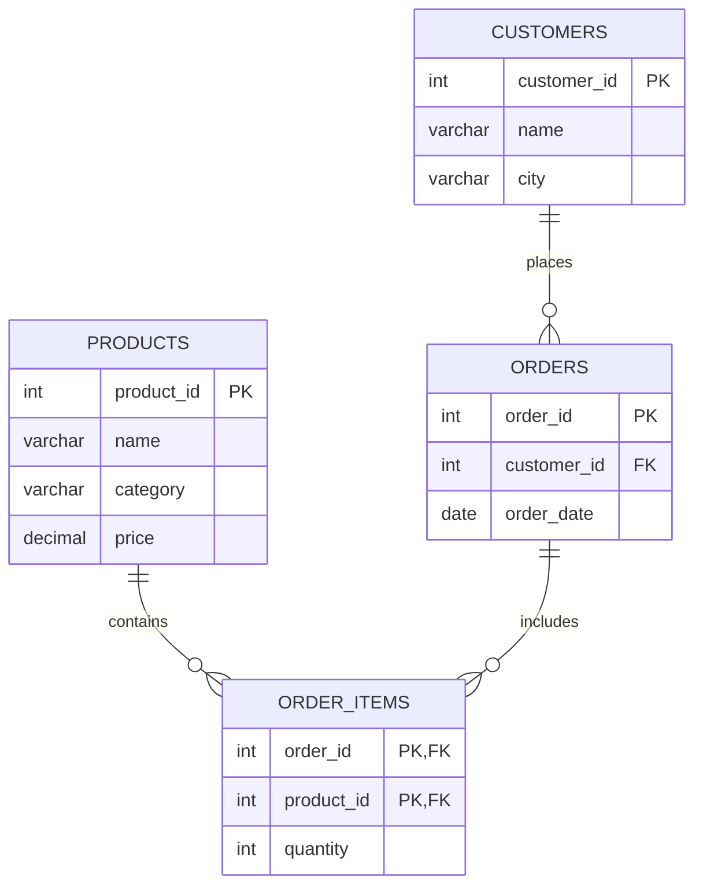

# Sales Analysis System 📊

A relational database ecosystem designed to model transactional e-commerce metrics, track historical data trends, and evaluate audience retention metrics.

## 📁 Project Overview
This project maps out a business intelligence environment across four primary entity domains to handle multi-category inventory tracking and consumer behavior analysis:
*   **Customers**: Location profiling and core regional indexing.
*   **Products**: Price point matrix across multiple market verticals.
*   **Orders**: Transactional time-series logging.
*   **Order Items**: Granular volume breakdowns per distinct checkout basket.

---

## 🛠️ Database Design & Relationships

The relational architecture uses a normalized structure with cascading reference rules to prevent orphaned transactions and maintain perfect data validation.

---

## 🚀 Engine Setup & Initialization

### Environment Requirements
*   **Database Management System**: MySQL / MariaDB (or any standard SQL runner).
*   **Interface Tools**: Command Line Tool, MySQL Workbench, DBeaver, or phpMyAdmin.

### Deployment Order
1.  **Schema Provisioning**: Build the isolated `sales_analysis` environment namespace.
2.  **Structural Tables**: Run the structural table blocks with foreign key constraints.
3.  **Data Hydration**: Populate the dimensional tables (`Customers`, `Products`) followed by the transactional arrays (`Orders`, `Order_Items`).

---

## 🔍 Core Business Intelligence Features

The integrated workspace file evaluates several core operational metrics:

### 🎯 Inventory Movement (Top Selling Products)
Isolates unit sales volume figures across individual items to pinpoint key physical inventory drivers and help supply chains manage warehouse reordering cycles.

### 💰 Gross Customer Lifetime Value (MVC)
Aggregates purchase totals across user profiles to flag high-yield consumers, enabling targeted promotional rewards and account management tiers.

### 📅 Time-Series Velocity (Monthly Revenue Analysis)
Consolidates invoice records into monthly intervals to visualize growth rates, track seasonal consumer shifts, and forecast quarterly budgets.

### 📦 Category Volume Splits (Category-Wise Sales)
Organizes overall item turnover based on product classification brackets to see which market verticals generate the most sales engagement.

### 📉 Audience Churn Risk (Inactive Cohorts)
Flags non-purchasing customer profiles by cross-referencing account histories over baseline windows (including a tight 90-day activity filter) to generate lists for automated email marketing win-back campaigns.
